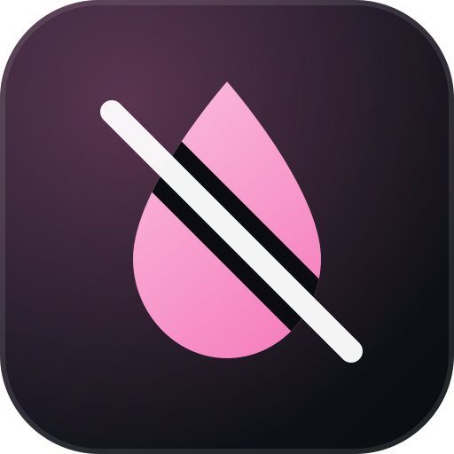

<div align="center">



# no-watermark

**Encuentra y elimina los caracteres invisibles escondidos en tu texto.**<br>
Caracteres de ancho cero, selectores de variación, esteganografía en el bloque de tags, controles bidireccionales y espacios parecidos. Una CLI en Python y una skill para agentes.

[](LICENSE)
[](https://github.com/obrenoalvim/no-watermark/stargazers)
[](pyproject.toml)

[English](README.md) · [Português](README.pt-BR.md) · **Español**

[Inicio rápido](#inicio-rápido) · [Ejemplo](#ejemplo) · [Uso por CLI](#uso-por-cli) · [Qué elimina](#qué-elimina) · [Seguridad con emoji](#seguridad-con-emoji) · [Skill para agentes](#skill-para-agentes) · [Preguntas frecuentes](#preguntas-frecuentes)

</div>

---

Detecta y elimina marcas de agua Unicode invisibles en el texto: caracteres de ancho cero, selectores de variación, esteganografía en el bloque de tags de Unicode, controles bidireccionales y sustitución de espacios anómalos. La eliminación es 100% determinista dentro de este alcance, y las secuencias de emoji legítimas quedan intactas por defecto.

Los caracteres ocultos pueden llevar una carga que nunca ves: una marca de agua de texto, o una instrucción dirigida a un modelo de IA (conocida como ASCII smuggling o prompt injection mediante caracteres invisibles). `nowatermark` te muestra lo que hay en el texto y lo elimina.

**Fuera de alcance:** las marcas de agua estadísticas de distribución de tokens (por ejemplo, el watermarking estilo Kirchenbauer con listas verde/roja). Exigen reescribir el texto y no tienen garantía de eliminación, así que esta herramienta no las aborda.

## Inicio rápido

```bash
pip install git+https://github.com/obrenoalvim/no-watermark.git
nowatermark detect sospechoso.txt
```

Requiere Python 3.10 o superior. Todavía no hay release en PyPI.

## Ejemplo

Pruébalo con el fixture que viene en el repositorio (`tests/fixtures/watermarked_sample.txt`):

```console
$ nowatermark detect tests/fixtures/watermarked_sample.txt
U+200B ZERO WIDTH SPACE [format-char] x1
U+200C ZERO WIDTH NON-JOINER [format-char] x1
U+200D ZERO WIDTH JOINER [format-char] x1
U+FEFF ZERO WIDTH NO-BREAK SPACE [format-char] x1
U+3000 IDEOGRAPHIC SPACE [space-variant] x1
U+00AD SOFT HYPHEN [other-invisible] x1
total: 6 watermark character(s) found

$ nowatermark clean tests/fixtures/watermarked_sample.txt -o limpio.txt --report
removed U+200B [format-char] x1
removed U+200C [format-char] x1
removed U+200D [format-char] x1
removed U+FEFF [format-char] x1
removed U+3000 [space-variant] x1
removed U+00AD [other-invisible] x1
```

## Uso por CLI

```bash
# escanea un archivo en busca de caracteres de marca de agua
nowatermark detect sospechoso.txt

# limpia un archivo, escribe en uno nuevo e imprime lo que se eliminó
nowatermark clean sospechoso.txt -o limpio.txt --report

# pasa texto por pipe
echo "algún texto" | nowatermark clean -
```

Códigos de salida: `0` limpio/éxito, `1` `detect` encontró caracteres de marca de agua, `2` error de uso/IO (archivo inexistente, UTF-8 inválido, la ruta es un directorio). Los errores salen como un mensaje simple en stderr, sin traceback de Python.

## Qué elimina

| Categoría | Ejemplos | Acción |
|---|---|---|
| Caracteres de formato (Unicode Cf) | espacio/unión/no-unión de ancho cero, unión de palabra, BOM, controles bidireccionales | eliminado |
| Selectores de variación | U+FE00–FE0F, U+E0100–E01EF | eliminado |
| Bloque de tags | U+E0000–E007F | eliminado (salvo que forme parte de una secuencia de bandera emoji) |
| Espacios anómalos | los 16 caracteres de espacio "Zs" de Unicode que no son ASCII (NBSP, marca de espacio Ogham, espacios fino/cabello/em/en, espacio ideográfico, etc.) | normalizado a un espacio común |
| Variantes de separador de línea | NEL (U+0085), SEPARADOR DE LÍNEA (U+2028), SEPARADOR DE PÁRRAFO (U+2029) | normalizado a `\n` |
| Área de uso privado | U+E000–F8FF (BMP) más los dos planos suplementarios de PUA | eliminado |
| Otros | guion blando, separador de vocal mongol, unión de grafema combinante, relleno de compatibilidad Hangul (U+3164) | eliminado |

La cobertura de espacios sale de la categoría Unicode "Zs" completa, no de una lista elegida a mano. Esto importa porque la investigación actual sobre watermarking de LLM (por ejemplo, [Innamark, IEEE Access 2025](https://arxiv.org/html/2502.12710)) marca el texto sustituyendo espacios comunes por *cualquier* carácter Zs visualmente idéntico, así que una cobertura parcial es fácil de eludir.

## Detección de homoglifos

`nowatermark detect` también señala palabras que mezclan letras latinas con letras cirílicas o griegas visualmente idénticas (por ejemplo, una `а` cirílica en lugar de una `a` latina). Es una técnica real para esconder una carga sin ningún carácter invisible, y [una investigación independiente sobre la ola de herramientas para quitar marcas de agua de IA de agosto de 2026](https://www.bleepingcomputer.com/news/security/ai-watermark-removers-flood-the-web-almost-none-can-prove-they-work/) confirma que está en uso.

El reporte aparece por separado y nunca afecta el exit code de `detect`. Mezclar scripts dentro de una misma palabra es raro en texto legítimo pero no imposible, así que tómalo como una señal para revisar, no como un hallazgo. `clean` no toca esas palabras, porque reescribir caracteres visibles es una garantía distinta, más arriesgada, que eliminar los invisibles (seguimiento en [TODO IMPROVEMENTS.md](TODO%20IMPROVEMENTS.md)).

## Seguridad con emoji

ZWJ/ZWNJ y los caracteres del bloque de tags también se usan de forma legítima en emoji (secuencias de familia/pareja, secuencias de bandera) y en algunas escrituras (ZWNJ en texto índico). Por defecto, `nowatermark clean` no elimina estos caracteres cuando están junto a codepoints de emoji o dentro de una secuencia válida de bandera emoji. Pasa `--no-emoji-guard` para eliminarlos sin condiciones.

`detect` reporta todo carácter candidato que encuentra, incluido un ZWJ dentro de una secuencia de emoji. Un emoji de familia, por ejemplo, lista tres caracteres ZERO WIDTH JOINER, y `clean` los conserva. Por eso `detect` puede salir con `1` en un texto que `clean` deja igual. Lee el reporte antes de actuar según el exit code.

## Skill para agentes

`skill/SKILL.md` lo empaqueta como una skill instalable para agentes de IA que soportan el formato SKILL.md. Colócalo en el directorio de skills de tu agente y detecta y limpia marcas de agua en el texto automáticamente durante una sesión. La skill también llama a la skill `stop-slop` para la limpieza estilística de la redacción.

## Desarrollo

```bash
git clone https://github.com/obrenoalvim/no-watermark.git
cd no-watermark
pip install -e ".[dev]"
pytest -v
```

---

## Preguntas frecuentes

**¿Elimina las marcas de agua estadísticas de texto de IA?**
No. Viven en la elección de palabras, no en los caracteres. Quitarlas exige reescribir el texto, y ninguna herramienta puede prometer un resultado limpio.

**¿Va a romper mis emoji o el texto no latino?**
`clean` conserva ZWJ y las secuencias de bandera junto a emoji por defecto. ZWJ y ZWNJ también aparecen de forma legítima en algunas escrituras (ZWNJ en texto índico), así que revisa la salida de `--report` antes de limpiar texto en esas escrituras.

**¿Por qué `detect` sale con 1 en un texto que se ve normal?**
Los caracteres invisibles son invisibles. Ejecuta `detect` para ver exactamente qué codepoints encontró y dónde están.

## Proyectos relacionados

[guillaumemeyer/watermarks-remover](https://github.com/guillaumemeyer/watermarks-remover) es una app open source popular en este campo. Cruzar la cobertura con ella añadió aquí el Área de uso privado y reforzó la comprobación de preservación de banderas emoji.

## Más skills para Claude Code del mismo autor

- [**zero-drift**](https://github.com/obrenoalvim/zero-drift): mantiene ancladas las sesiones largas con respuestas con nombre y un `TASK.md` vivo.
- [**keep-improving**](https://github.com/obrenoalvim/keep-improving): un bucle autónomo de mejora con un panel de revisión de diez roles.
- [**unblock**](https://github.com/obrenoalvim/unblock): una cadena gratuita de 13 herramientas para investigación web que sigue intentando.
- [**findable**](https://github.com/obrenoalvim/findable): investigación de SEO y GEO que aplica las correcciones seguras.

## Contribuir

¿Encontraste una clase de carácter que se escapa, o una secuencia legítima que se elimina? Abre un issue o un PR. Consulta el [CONTRIBUTING.md](CONTRIBUTING.md) y el [changelog](CHANGELOG.md).

## Licencia

[MIT](LICENSE)

---

<div align="center">

Si no-watermark encontró algo escondido en tu texto, una ⭐ ayuda a que otras personas lo encuentren también.

<sub>**Temas:** unicode · zero-width-characters · invisible-characters · watermark · steganography · ascii-smuggling · prompt-injection · text-sanitizer · cli · python · security · claude-skill</sub>

</div>
